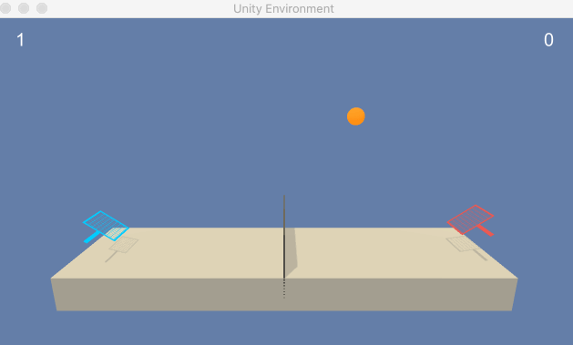

# DRLND-Collaboration-and-Competition
This is the third project of Udacity Deep Reinforcement Learning Nanodegree Program. In this project, I implemented the Multi-Agent Deep Deterministic Policy Gradients in the [Tennis](https://github.com/Unity-Technologies/ml-agents/blob/master/docs/Learning-Environment-Examples.md#tennis) environment and the goal of my agent is to bounce the ball between one another while not dropping or sending ball out of bounds.

## Demo

 

I've implement deep reinforcement learning algorithm with Pytorch. 
In this project, the following algorithms have been implemented:

- [x] Multi-Agents Deep Deterministic Policy Gradients (MADDPG)

## Project Details

In this environment, two agents control rackets to bounce a ball over a net. If an agent hits the ball over the net, it receives a reward of +0.1. If an agent lets a ball hit the ground or hits the ball out of bounds, it receives a reward of -0.01. Thus, the goal of each agent is to keep the ball in play.

The observation space consists of 8 variables corresponding to the position and velocity of the ball and racket. Each agent receives its own, local observation. Two continuous actions are available, corresponding to movement toward (or away from) the net, and jumping.

## Solving the Environment

The task is episodic, and in order to solve the environment, your agents must get an average score of +0.5 (over 100 consecutive episodes, after taking the maximum over both agents). Specifically, after each episode, we add up the rewards that each agent received (without discounting), to get a score for each agent. This yields 2 (potentially different) scores. We then take the maximum of these 2 scores. This yields a single score for each episode. The environment is considered solved, when the average (over 100 episodes) of those scores is at least +0.5.

## Getting Started

1. Download the environment from one of the links below. You need only select the environnment that matches your operating system:
    - Linux: [click here](https://s3-us-west-1.amazonaws.com/udacity-drlnd/P3/Tennis/Tennis_Linux.zip)
    - Mac OSX: [click here](https://s3-us-west-1.amazonaws.com/udacity-drlnd/P3/Tennis/Tennis.app.zip)
    - Windows (32-bit): [click here](https://s3-us-west-1.amazonaws.com/udacity-drlnd/P3/Tennis/Tennis_Windows_x86.zip)
    - Windows (64-bit): [click here](https://s3-us-west-1.amazonaws.com/udacity-drlnd/P3/Tennis/Tennis_Windows_x86_64.zip)

2. Place the files in this directory, and unzip (or decompress) the files. 

## Instructions
To train your model to solve the environment, simply run

`python train.py`

To play your model, simply run

`python play.py --checkpoint_path='/../drlnd_collab-compet/' --num_episodes=5`

## References
- [Multi-Agent Actor-Critic for Mixed Cooperative-Competitive Environments](https://arxiv.org/abs/1706.02275)
- [unityml-tennis](https://github.com/katnoria/unityml-tennis)
- Framework provided by Udacity Deep Reinforcement Learning Nanodegree Program.

